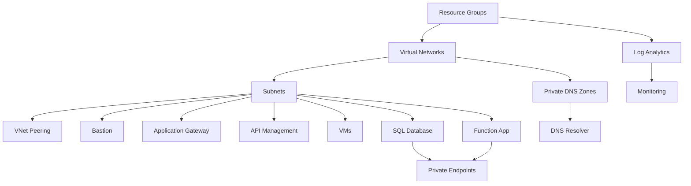

# Terraform Solution Structure

## Overview

This document describes the complete structure of the Hub-Spoke Terraform solution.

## Directory Tree

```
terraform/
├── environments/
│   └── dev/
│       ├── main.tf
│       ├── resources.tf
│       ├── locals.tf
│       ├── variables.tf
│       ├── terraform.tfvars
│       └── outputs.tf
│
├── modules/
│   ├── resource-group/
│   │   ├── main.tf
│   │   ├── variables.tf
│   │   └── outputs.tf
│   │
│   ├── virtual-network/
│   │   ├── main.tf
│   │   ├── variables.tf
│   │   └── outputs.tf
│   │
│   ├── vnet-peering/
│   │   ├── main.tf
│   │   ├── variables.tf
│   │   └── outputs.tf
│   │
│   ├── bastion/
│   │   ├── main.tf
│   │   ├── variables.tf
│   │   └── outputs.tf
│   │
│   ├── api-management/
│   │   ├── main.tf
│   │   ├── variables.tf
│   │   └── outputs.tf
│   │
│   ├── application-gateway/
│   │   ├── main.tf
│   │   ├── variables.tf
│   │   └── outputs.tf
│   │
│   ├── private-dns-zone/
│   │   ├── main.tf
│   │   ├── variables.tf
│   │   └── outputs.tf
│   │
│   ├── private-endpoint/
│   │   ├── main.tf
│   │   ├── variables.tf
│   │   └── outputs.tf
│   │
│   ├── dns-resolver/
│   │   ├── main.tf
│   │   ├── variables.tf
│   │   └── outputs.tf
│   │
│   ├── virtual-machine/
│   │   ├── main.tf
│   │   ├── variables.tf
│   │   └── outputs.tf
│   │
│   ├── function-app/
│   │   ├── main.tf
│   │   ├── variables.tf
│   │   └── outputs.tf
│   │
│   ├── sql-database/
│   │   ├── main.tf
│   │   ├── variables.tf
│   │   └── outputs.tf
│   │
│   ├── log-analytics/
│   │   ├── main.tf
│   │   ├── variables.tf
│   │   └── outputs.tf
│   │
│   ├── storage-account/
│   │   ├── main.tf
│   │   ├── variables.tf
│   │   └── outputs.tf
│   │
│   └── monitoring/
│       ├── main.tf
│       ├── variables.tf
│       └── outputs.tf
│
└── docs/
    ├── architecture-diagrams/
    │   └── hub-spoke-architecture.png
    ├── solution-structure.md
    └── implementation-guide.md
```

## File Descriptions

### Environment Files (environments/dev/)

#### main.tf
- Terraform version requirements
- Provider configuration (azurerm)
- Backend configuration for state management

#### resources.tf
- All resource module instantiations
- Organized by resource type
- Implements dependencies between resources

#### locals.tf
- Local variables for resource naming
- Network configurations
- Centralized configuration maps

#### variables.tf
- All variable declarations
- Default values
- Type definitions

#### terraform.tfvars
- Environment-specific values
- Network address spaces
- Feature flags
- SKU configurations

#### outputs.tf
- Resource IDs
- FQDNs
- IP addresses
- Other important values

### Module Structure

Each module follows the same pattern:

#### main.tf
- Resource definitions
- Uses Azure Verified Modules (AVM) where available
- Implements module-specific logic

#### variables.tf
- Input variable declarations
- Type constraints
- Default values

#### outputs.tf
- Exported values
- Resource IDs and properties

## Resource Dependencies



## Module Usage Pattern

All modules are called from `resources.tf` using conditional creation:

```hcl
module "resource_name" {
  count = var.create_resource ? 1 : 0
  
  source = "../../modules/module-name"
  
  # Module parameters
  ...
  
  depends_on = [prerequisite_resources]
}
```

## Azure Verified Modules (AVM)

The following modules use AVM:

1. **resource-group**: `Azure/avm-res-resources-resourcegroup/azurerm`
2. **virtual-network**: `Azure/avm-res-network-virtualnetwork/azurerm`
3. **bastion**: `Azure/avm-res-network-bastionhost/azurerm`
4. **api-management**: `Azure/avm-res-apimanagement-service/azurerm`
5. **virtual-machine**: `Azure/avm-res-compute-virtualmachine/azurerm`
6. **storage-account**: `Azure/avm-res-storage-storageaccount/azurerm`
7. **sql-database**: `Azure/avm-res-sql-server/azurerm`
8. **log-analytics**: `Azure/avm-res-operationalinsights-workspace/azurerm`

## Customization Points

### Adding New Resources

1. Create module in `modules/` directory
2. Add module call in `resources.tf`
3. Add configuration in `locals.tf`
4. Add feature flag in `variables.tf`
5. Set values in `terraform.tfvars`
6. Export outputs in `outputs.tf`

### Modifying Network Topology

1. Update `locals.tf` VNet configurations
2. Add/remove VNet modules in `resources.tf`
3. Update peering configurations
4. Adjust address spaces in `terraform.tfvars`

### Environment Replication

To create a new environment (staging, prod):

1. Copy `environments/dev` to `environments/{new-env}`
2. Update `terraform.tfvars` with new values
3. Adjust backend configuration in `main.tf`
4. Deploy independently

## Best Practices Implemented

1. **Modularity**: Reusable modules for all resources
2. **AVM Usage**: Leverages official Azure modules
3. **Variable Management**: Centralized configuration
4. **State Management**: Remote backend configuration
5. **Dependency Management**: Explicit depends_on statements
6. **Feature Flags**: Conditional resource creation
7. **Tagging**: Consistent resource tagging
8. **Naming**: Following Azure naming conventions

## Next Steps

1. Review and customize `terraform.tfvars`
2. Set sensitive variables as environment variables
3. Initialize Terraform
4. Plan and apply configuration
5. Review outputs
6. Access resources via Azure Portal

## Related Documentation

- See `implementation-guide.md` for deployment instructions
- See architecture diagrams in `architecture-diagrams/`
